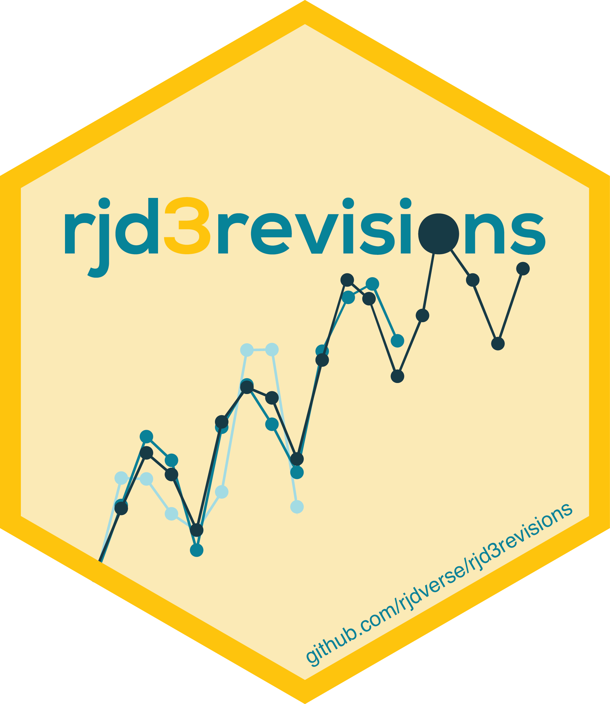

<!-- README.md is generated from README.Rmd. Please edit that file -->

# `rjd3revisions` <a href="https://rjdverse.github.io/rjd3revisions/"></a>

<!-- badges: start -->

[](https://CRAN.R-project.org/package=rjd3revisions)

[](https://github.com/rjdverse/rjd3revisions/actions/workflows/R-CMD-check.yaml)
[](https://github.com/rjdverse/rjd3revisions/actions/workflows/lint.yaml)

[](https://github.com/rjdverse/rjd3revisions/actions/workflows/pkgdown.yaml)
<!-- badges: end -->

Most economic indicators are published several times for a given
reporting period, this entails revisions as time horizon changes.
rjd3revisions performs a battery of tests on these revisions and
generates a report with the results. The various tests enable the users
to detect potential bias and sources of inefficiency in preliminary
estimates.

## Installation

Running rjd3 packages requires **Java 17 or higher**. How to set up such
a configuration in R is explained
[here](https://jdemetra-new-documentation.netlify.app/#Rconfig)

### Latest release

To get the current stable version (from the latest release):

- From GitHub:

``` r
# install.packages("remotes")
remotes::install_github("rjdverse/rjd3toolkit@*release")
remotes::install_github("rjdverse/rjd3revisions@*release", build_vignettes = TRUE)
```

- From [r-universe](https://rjdverse.r-universe.dev/rjd3revisions):

``` r
install.packages("rjd3revisions", repos = c("https://rjdverse.r-universe.dev", "https://cloud.r-project.org"))
```

### Development version

You can install the development version of **rjd3revisions** from
[GitHub](https://github.com/) with:

``` r
# install.packages("remotes")
remotes::install_github("rjdverse/rjd3revisions")
```

## Usage

``` r
library("rjd3revisions")
#> 
#> Attaching package: 'rjd3revisions'
#> The following object is masked from 'package:utils':
#> 
#>     View
```

First you need to get your input data set as a data.frame in R in a
specific format as below. Note that missing values can either be
mentioned as NA (as in the example below) or not be included in the
input at the best convenience of the user.

### Format 1: long view

| rev_date   | time_period | obs_values |
|------------|-------------|------------|
| 2022-07-31 | 2022Q1      | 0.8        |
| 2022-07-31 | 2022Q2      | 0.2        |
| 2022-07-31 | 2022Q3      | NA         |
| 2022-07-31 | 2022Q4      | NA         |
| 2022-08-31 | 2022Q1      | 0.8        |
| …          | …           | …          |

### Format 2: vertical view

| Period  | 2023/03/31 | 2023/04/30 | 2023/05/31 |
|---------|------------|------------|------------|
| 2022M01 | 15.2       | 15.1       | 15.0       |
| 2022M02 | 15.0       | 14.9       | 14.9       |
| …       | …          | …          | …          |
| 2023M01 | 13.0       | 13.1       | 13.2       |
| 2023M02 |            | 12.1       | 12.1       |
| 2023M03 |            |            | 12.3       |

### Format 3: horizontal view

| Period     | 2022M01 | 2022M02 | …   | 2023M01 | 2023M02 | 2023M03 |
|------------|---------|---------|-----|---------|---------|---------|
| 2023/03/31 | 15.2    | 15.0    | …   | 13.0    |         |         |
| 2023/04/30 | 15.1    | 14.9    | …   | 13.1    | 12.1    |         |
| 2023/05/31 | 15.0    | 14.9    | …   | 13.2    | 12.1    | 12.3    |

Depending on the location of your input data, you can use
`create_vintages_from_xlsx()` or `create_vintages_from_csv()`, or the
more generic function `create_vintages()` to create the vintages.

``` r
set.seed(7)

# Examples
long_view <- simulate_long(
    periodicity = 4, 
    n_period = 4 * 10, 
    n_revision = 7, 
    start_period = as.Date("2000-01-01")
)
```

Then you can create your vintages and plot the vintages and inspect the
revisions (optional)

``` r
vintages <- create_vintages(long_view, periodicity = 4)
plot(vintages, lwd = 2)
```


``` r

revisions <- get_revisions(vintages, gap = 2)
plot(revisions)
```


and make the analysis

``` r
rslt <- revision_analysis(vintages, gap = 1, view = "diagonal", n.releases = 3)

print(rslt)
#>                                            Transf. [Release[2]]-[Release[1]]
#> Relevancy - Theil U2                          None              Good (0.339)
#> Bias1 T-test                                  None              Good (0.798)
#> Bias2 Augmented T-test                        None              Good (0.823)
#> Bias3 SlopeAndDrift (Ols L on P) - Mean       None              Good (0.347)
#> Bias3 SlopeAndDrift (Ols L on P) - Reg.       None              Good (0.232)
#> Efficiency1 (Ols R on P) - Mean            Delta 1              Good (0.166)
#> Efficiency1 (Ols R on P) - Reg.            Delta 1              Good (0.107)
#> Efficiency2 (Ols Rv on Rv_1) - Mean           None                          
#> Efficiency2 (Ols Rv on Rv_1) - Reg.           None                          
#> Orthogonality1 (Ols Rv on Rv_(1:p)) - Mean    None                          
#> Orthogonality1 (Ols Rv on Rv_(1:p)) - Reg.    None                          
#> Orthogonality2 (Ols Rv on Rv_k.) - Mean       None                          
#> Orthogonality2 (Ols Rv on Rv_k) - Reg.        None                          
#> Orthogonality3 AutoCorrelation (Ljung-Box)    None              Good (0.417)
#> Orthogonality4 Seasonality (Ljung-Box)     Delta 1              Good (0.993)
#> Orthogonality4 Seasonality (Friedman)      Delta 1              Good (0.137)
#> SignalVsNoise1 - Noise (Ols R on P)        Delta 1              Good (0.082)
#> SignalVsNoise2 - Signal (Ols R on L)       Delta 1         Uncertain (0.053)
#>                                            [Release[3]]-[Release[2]]
#> Relevancy - Theil U2                                    Good (0.225)
#> Bias1 T-test                                            Good (0.805)
#> Bias2 Augmented T-test                                  Good (0.806)
#> Bias3 SlopeAndDrift (Ols L on P) - Mean                 Good (0.584)
#> Bias3 SlopeAndDrift (Ols L on P) - Reg.                 Good (0.624)
#> Efficiency1 (Ols R on P) - Mean                         Good (0.300)
#> Efficiency1 (Ols R on P) - Reg.                         Good (0.240)
#> Efficiency2 (Ols Rv on Rv_1) - Mean                     Good (0.818)
#> Efficiency2 (Ols Rv on Rv_1) - Reg.                     Good (0.298)
#> Orthogonality1 (Ols Rv on Rv_(1:p)) - Mean              Good (0.818)
#> Orthogonality1 (Ols Rv on Rv_(1:p)) - Reg.              Good (0.702)
#> Orthogonality2 (Ols Rv on Rv_k.) - Mean                 Good (0.818)
#> Orthogonality2 (Ols Rv on Rv_k) - Reg.                  Good (0.298)
#> Orthogonality3 AutoCorrelation (Ljung-Box)              Good (0.999)
#> Orthogonality4 Seasonality (Ljung-Box)                  Good (1.000)
#> Orthogonality4 Seasonality (Friedman)                   Good (0.769)
#> SignalVsNoise1 - Noise (Ols R on P)                     Good (0.248)
#> SignalVsNoise2 - Signal (Ols R on L)               Uncertain (0.856)
# summary(rslt)
View(rslt)
```


Finally to create a report and get a summary of the results, you can use

``` r
render_report(
    rslt,
    output_file = "my_report",
    output_dir = tempdir(),
    output_format = "pdf_document"
)
```

## Additional information

This README.md file gives you a quick example of how to proceed. Consult
the vignette (with `browseVignettes("rjd3revisions")`) and the
documentation of each function (for example: `?create_vintages`,
`?revision_analysis`) to see the current possibilities of the tool.

## Package Maintenance and contributing

Any contribution is welcome and should be done through pull requests
and/or issues. pull requests should include **updated tests** and
**updated documentation**. If functionality is changed, docstrings
should be added or updated.

## Licensing

The code of this project is licensed under the [European Union Public
Licence
(EUPL)](https://joinup.ec.europa.eu/collection/eupl/eupl-text-eupl-12).
